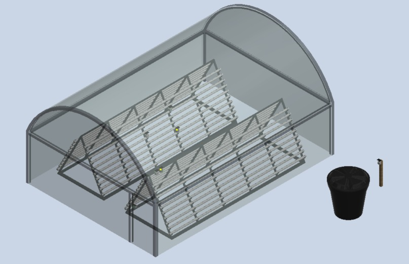
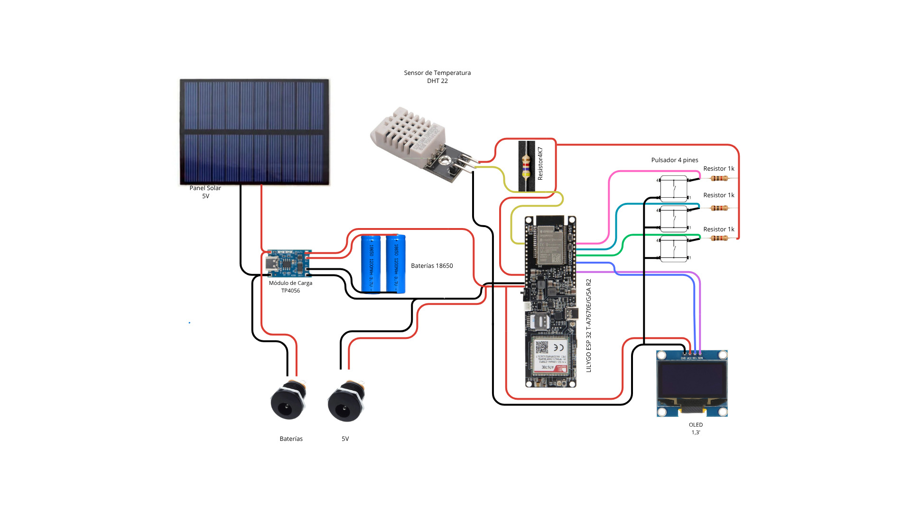
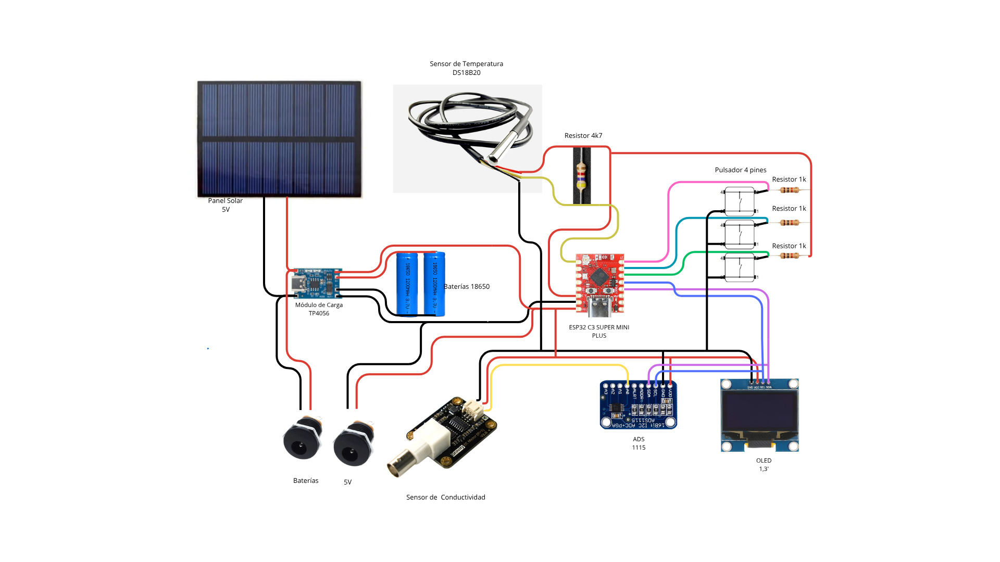
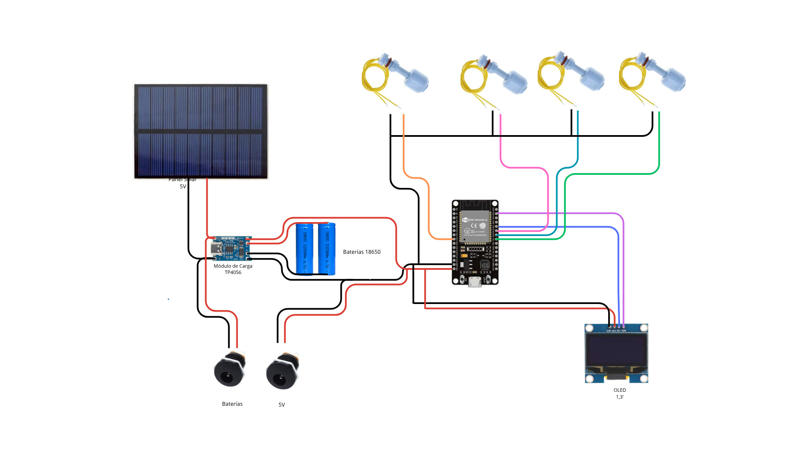
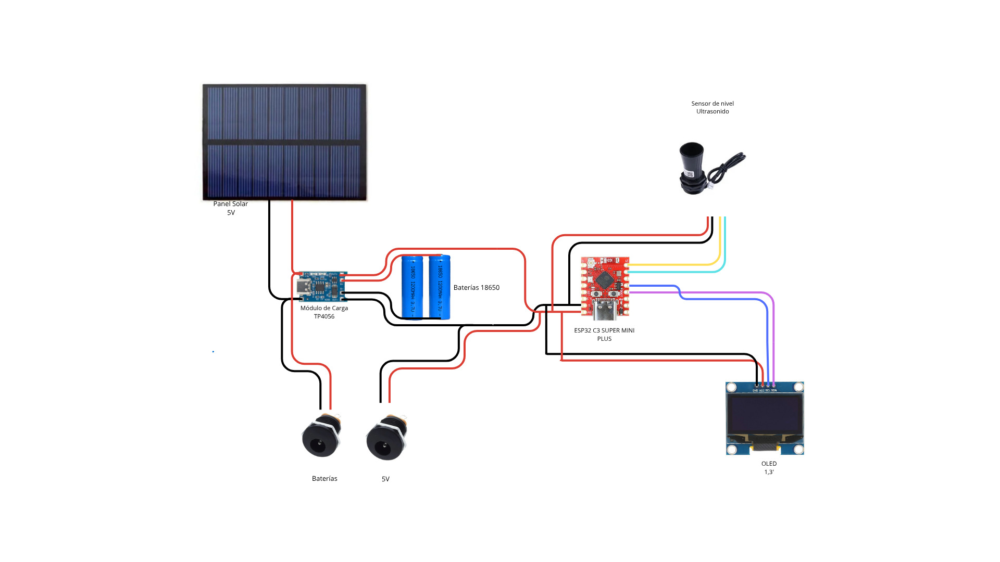
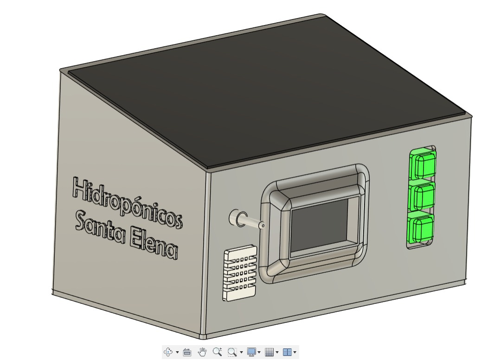
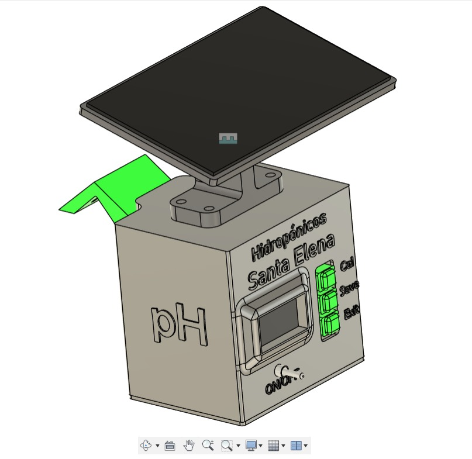
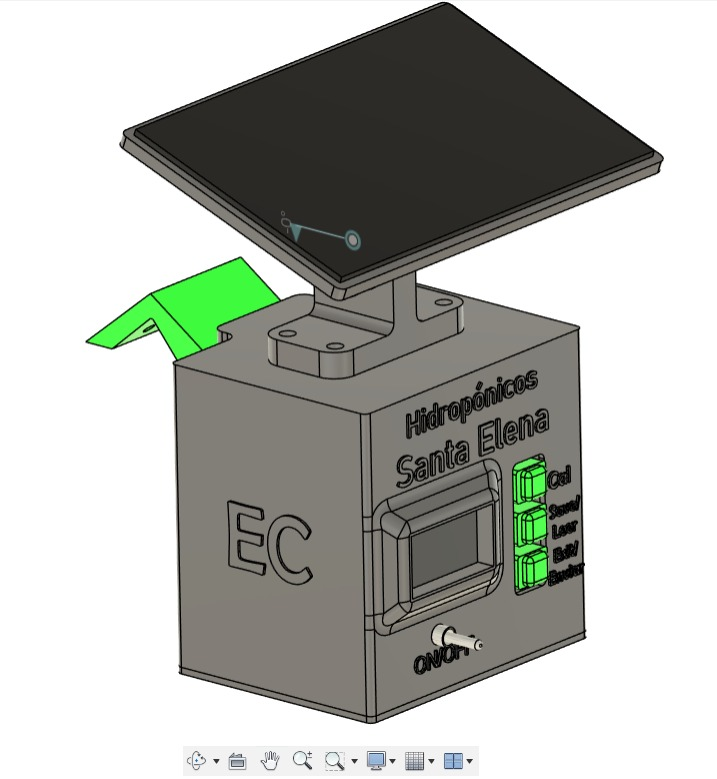
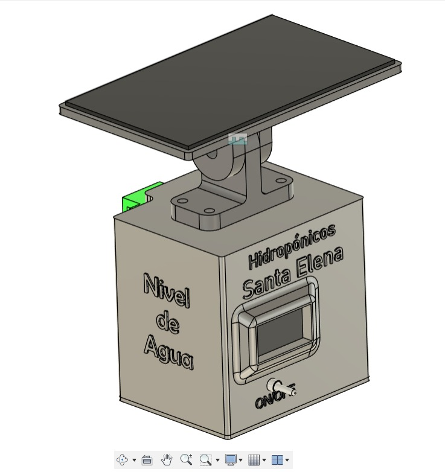
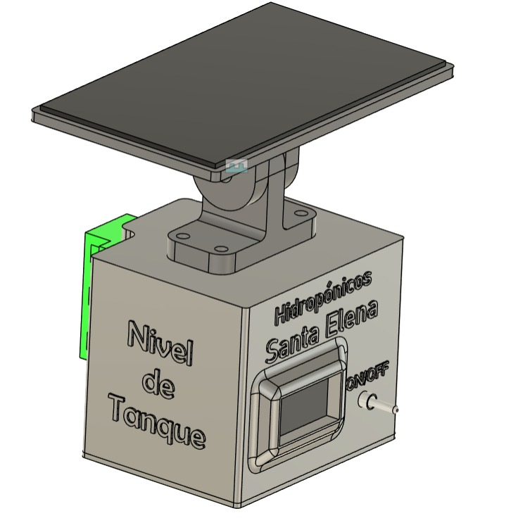

# ⚙️ Proyecto: Sistema de Monitoreo IoT Aplicado a Cultivos de Lechuga Hidropónica

Este proyecto utiliza la **ESP32** como microcontrolador principal en tres diferentes versiones, con el objetivo de recolectar datos de variables críticas de cultivos hidropónicos, tales como:  
**pH, conductividad eléctrica, temperatura y humedad relativa, temperatura del agua, nivel de agua en los tubos y nivel de agua en el tanque.**

---

   
  <em>Invernadero - Unidad de Cultivo</em>

---

## 🧰 Componentes Utilizados

- 1 LilyGo T-SIM-A7670E  
- 3 ESP32-C3 Super Mini Plus  
- 1 ESP32 DevKit V1  
- 1 Sensor de pH con electrodo industrial  
- 1 Sensor de conductividad eléctrica  
- 1 Sensor de temperatura y humedad DHT22  
- 2 Sensores de temperatura DS18B20  
- 4 Sensores de nivel analógicos  
- 1 Sensor de nivel ultrasónico  
- 2 Módulos ADC ADS1115  
- 5 Pantallas OLED 1.3"  
- 5 Módulos de carga TP4056  
- 5 Paneles solares de 5 V  
- 10 Baterías 18650 (2 por cada módulo)  
- 9 Pulsadores (3 por cada módulo que los incluye)  

---

## 🧠 Funcionamiento General

El sistema está conformado por **5 módulos**, de los cuales:
- **4 módulos emisores** se encargan de recolectar los datos de los sensores asignados y enviarlos mediante el protocolo ESPNOW.
- **1 módulo receptor (principal)** recibe toda la información de los emisores y la envía a una **base de datos** para su almacenamiento y análisis.

---

## 🖼️ Diagramas e Imágenes de los Módulos

### 📊 Diagramas de Conexión

   
  <em>Diagrama de conexión - Módulo principal</em>

   
  <em>Diagrama de conexión - Módulo pH</em>

   
  <em>Diagrama de conexión - Módulo conductividad</em>

   
  <em>Diagrama de conexión - Módulo nivel de agua en tubos</em>

   
  <em>Diagrama de conexión - Módulo nivel de agua en tanque</em>

---

### 🧩 Montaje Real de los Módulos

   
  <em>Montaje del módulo principal</em>

   
  <em>Montaje del módulo pH</em>

   
  <em>Montaje del módulo conductividad</em>

   
  <em>Montaje del módulo nivel de agua en tubos</em>

   
  <em>Montaje del módulo nivel de agua en tanque</em>

---
###  🔗 Repositorio relacionado

📦 [Repositorio de base de datos y página web](https://github.com/pdlhcontadero-coder/PMLHC)

---
## 👥 Autores

- **Alejandro Díaz Igua**  
- **David Eraso García**  
- **Ana Sofía Muñoz Villota**  
- **Ivette Camila Yepez Morán**

---

📍 *Proyecto académico.*
